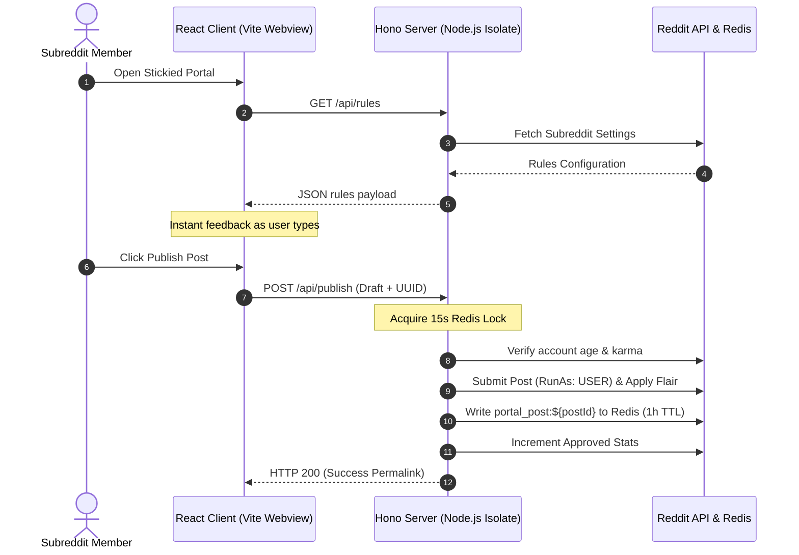

# 🚀 PostPilot: Proactive Reddit Moderation Portal

> Shift moderation left. Validate, filter, and enforce subreddit policies directly in a client-side React sandbox before the post ever touches the Reddit database.

Traditional Reddit moderation is reactive: AutoModerator and custom bots scan and delete rule-breaking content *after* it pollutes the database, clutters mod queues, and frustrates users who spent time formatting drafts. 

**PostPilot** transforms moderation from a janitorial task into architectural enforcement. Deployed as a stickied Devvit Web application, it provides an isolated drafting portal that checks regex title structures, body lengths, and blacklist keywords locally. Bypasses are blocked by a backend enforcer, while moderators monitor operations via a private telemetry hub.

---

## ⚡ Quick Start: Get Running in 30 Seconds

Follow these quick commands to spin up the local development/playtest environment and verify the test suites:

### 1. Install Dependencies
```bash
npm install
```

### 2. Run the Verification Tests
Run the 34 unit tests covering Hono routers, Redis locking, and client Markdown engines:
```bash
npm test
```

### 3. Log In to Devvit
Authenticate with your Reddit developer credentials:
```bash
npx devvit login
```

### 4. Start Local Playtest
Deploy the app locally and tunnel it to your test subreddit (recompiles automatically on code save):
```bash
npx devvit playtest <your-test-subreddit>
```

### 5. Build & Ship for Production
Compile optimized client and server bundles:
```bash
npm run build
```
Upload the production code to the Devvit App Registry and install it on your subreddit:
```bash
npx devvit upload
npx devvit install <your-subreddit-name>
```

---

## ✨ Features

- **⚡ Zero-Latency Client Validation**: Real-time validation checklist (title regex, word counts, blacklist) matches subreddit rules as the user types.
- **🛡️ Digital Fortress Backend**: Secondary validation of account age and karma prevents API spoofing. 
- **🔒 Redis NX Idempotency Lock**: A 15-second submission lock eliminates duplicate posts under unstable connections.
- **🤖 Fallback Enforcer Trigger**: A background `PostSubmit` hook instantly deletes native posts that bypass the portal, replying with an official mod warning.
- **📊 Moderator Telemetry Hub**: Private dashboard for moderators to view approved posts, block rates, and enforcer bypass counts with pure-CSS visuals.
- **✍️ Live Markdown Preview**: Custom lightweight parser renders rich text drafts instantly without massive external dependencies.
- **🔋 Clipboard Pasteurizer**: Intercepts rich text/HTML paste events to strip binary media and prevent large payloads from breaching Devvit's 4MB limit.

---

## 🏗️ Architecture Flow



---

## ⚙️ Configuration Schema

PostPilot rules are defined declaratively in the `devvit.json` settings schema:

| Setting Key | Type | Description |
| :--- | :--- | :--- |
| `title_regex` | `string` | Regex pattern that post titles must match (e.g., `^\[[a-zA-Z]+\].*$` for brackets). |
| `min_body` | `number` | Minimum character length for the post markdown text. |
| `flair_id` | `string` | Reddit Flair Template UUID applied automatically upon publication. |
| `keyword_blacklist` | `string` | Comma-separated list of forbidden keywords (e.g. `crypto,scam,spam`). |
| `minimum_account_age` | `number` | Minimum age of the posting user's account in days. |
| `minimum_karma` | `number` | Minimum combined (link + comment) karma of the posting user. |
| `enforcer` | `boolean` | Global toggle to enable/disable the native post bypass enforcer. |

---

## 🚀 Installation & Deployment

Follow these steps to deploy PostPilot to your subreddit:

### 1. Prerequisites
Ensure you have the Devvit CLI installed and are logged into your Reddit account:
```bash
npm install -g @devvit/cli
devvit login
```

### 2. Scaffold and Build
Install local dependencies and compile both the Hono backend and React frontend:
```bash
npm install
npm run build
```

### 3. Upload & Install
Upload the build bundles to Reddit's app registry and install it on your subreddit:
```bash
devvit upload
devvit install <your-subreddit-name>
```

### 4. Deploy Portal Post
Once installed:
1. Navigate to your subreddit's native moderation menu in the Reddit UI.
2. Select **"Deploy PostPilot Interactive Portal"**.
3. PostPilot will submit the portal canvas post and pin it to sticky slot 1.
4. Configure rules inside your Subreddit's App Settings console.

---

## 🧪 Testing Suite

PostPilot features a comprehensive testing system utilizing **Vitest** to isolate and mock Devvit plugins (Redis, Reddit API, and Subreddit Settings).

To execute the test suite:
```bash
npm test
```

### Coverage Areas
- **Client Utilities (`src/client/utils.test.ts`)**: Verifies title regexes, character count thresholds, blacklist checks, and Markdown block/list parsers.
- **Server Endpoints (`src/server/index.test.ts`)**: Tests Hono router endpoints, Redis idempotency locking logic, user qualification criteria, and the background enforcer auto-removal mechanism.

---

## 📦 Bundle Optimization Specs
PostPilot is designed for performance under Devvit's V8 execution limits:
- **Vite Client Bundle**: `~170 kB` (HTML + React + CSS)
- **Esbuild Server Bundle**: `~67 kB` (Hono Server Router)
- **Total Application Footprint**: `< 240 kB` (Allows fast startup times, loading instantly inside the Reddit iframe sandbox, well below the 4MB limit).

---

## 🤝 Contributing Guidelines

1. Keep all state management flat and centralized in `src/client/App.tsx`.
2. Place helper functions and validators in `src/client/utils.ts` to ensure clean unit-testing separation.
3. Maintain TypeScript compilation safety: verify changes compile successfully via `npm run build` and all tests pass with `npm test` before committing.
