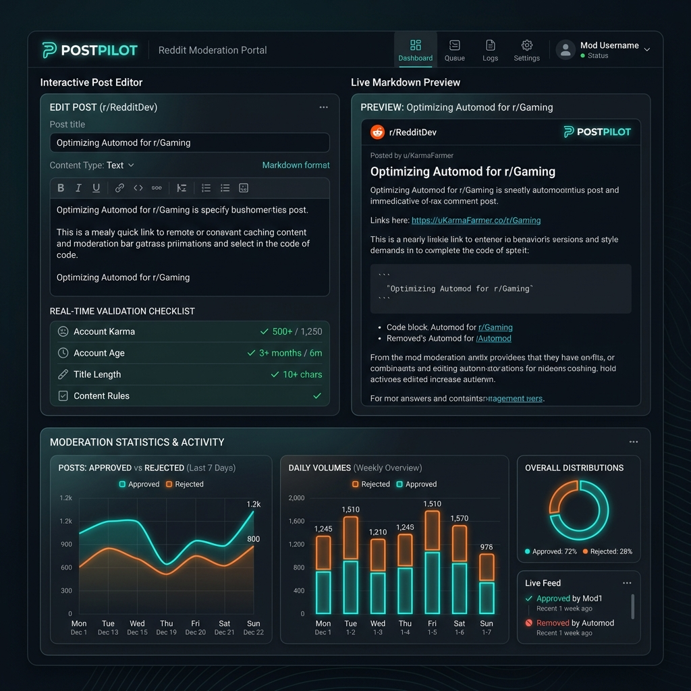
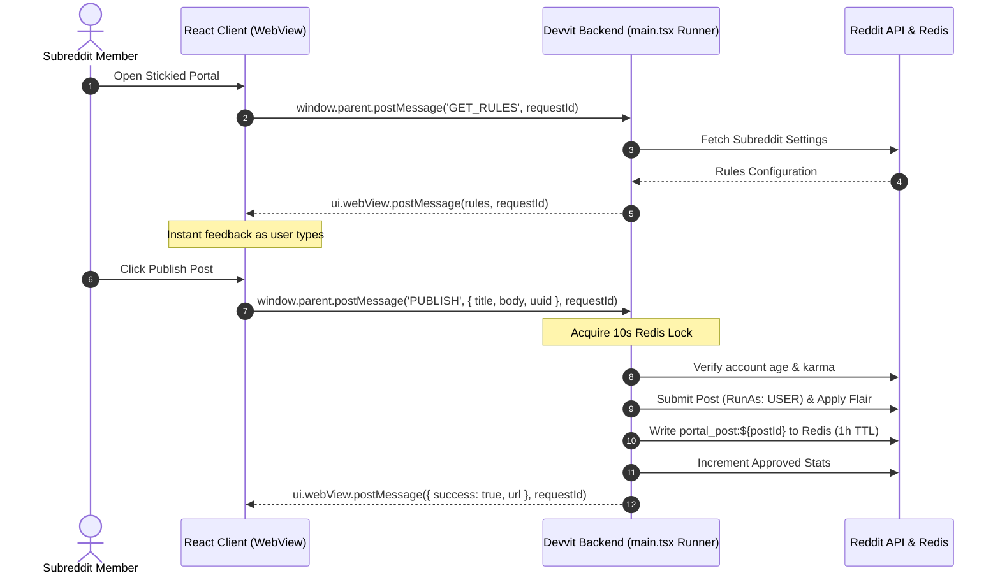

# 🚀 PostPilot: Proactive Reddit Moderation Portal

> Shift moderation left. Validate, filter, and enforce subreddit policies directly in a client-side React sandbox before the post ever touches the Reddit database.



Traditional Reddit moderation is reactive: AutoModerator and custom bots scan and delete rule-breaking content *after* it pollutes the database, clutters mod queues, and frustrates users who spent time formatting drafts. 

**PostPilot** transforms moderation from a janitorial task into architectural enforcement. Deployed as a stickied Devvit Web application, it provides an isolated drafting portal that checks regex title structures, body lengths, and blacklist keywords locally. Bypasses are blocked by a backend enforcer, while moderators monitor operations via a private telemetry hub.

---

## ⚡ Quick Start: Get Running in 30 Seconds

> [!NOTE]
> The registered Devvit app slug name inside `devvit.json` is `postpilot-portal`. When running playtesting or installation commands, this is configured automatically by the CLI.

Follow these quick commands to spin up the local development/playtest environment and verify the test suites:

### 1. Install Dependencies
```bash
npm install
```

### 2. Run the Verification Tests
Run the unit tests covering client Markdown engines and input validators:
```bash
npm test
```

### 3. Build Client Assets
Compile the React WebView application using Vite:
```bash
npm run build
```

### 4. Start Local Playtest on ughackathons Subreddit
Deploy the app locally and install it to the `ughackathons` playtest subreddit:
```bash
npx devvit playtest ughackathons
```

---

## ✨ Features

- **⚡ Zero-Latency Client Validation**: Real-time validation checklist (title regex, word counts, blacklist) matches subreddit rules as the user types.
- **🛡️ Digital Fortress Backend**: Secondary validation of account age and karma prevents API spoofing. 
- **🔒 Redis NX Idempotency Lock**: A 10-second submission lock eliminates duplicate posts under unstable connections.
- **🤖 Fallback Enforcer Trigger**: A background `PostSubmit` hook instantly deletes native posts that bypass the portal, replying with an official mod warning.
- **📊 Moderator Telemetry Hub**: Private dashboard for moderators to view approved posts, block rates, and enforcer bypass counts with pure-CSS visuals.
- **✍️ Live Markdown Preview**: Custom lightweight parser renders rich text drafts instantly without massive external dependencies.
- **🔋 Clipboard Pasteurizer**: Intercepts rich text/HTML paste events to strip binary media and prevent large payloads from breaching Devvit's 4MB limit.

---

## 🏗️ Architecture Flow



---

## ⚙️ Configuration Schema

PostPilot rules are defined declaratively in the `devvit.json` settings schema:

| Setting Key | Type | Description |
| :--- | :--- | :--- |
| `title_regex` | `string` | Regex pattern that post titles must match (e.g., `^\[[a-zA-Z]+\].*$` for brackets). |
| `min_body` | `number` | Minimum character length for the post markdown text. |
| `flair_id` | `string` | Reddit Flair Template UUID applied automatically upon publication. |
| `keyword_blacklist` | `string` | Comma-separated list of forbidden keywords (e.g. `crypto,scam,spam`). |
| `minimum_account_age` | `number` | Minimum age of the posting user's account in days. |
| `minimum_karma` | `number` | Minimum combined (link + comment) karma of the posting user. |
| `enforcer` | `boolean` | Global toggle to enable/disable the native post bypass enforcer. |

---

## 🚀 Installation & Deployment

Follow these steps to deploy PostPilot to your subreddit:

### 1. Prerequisites
Ensure you are logged into your Reddit account via the CLI:
```bash
npx devvit login
```

### 2. Scaffold and Build
Install local dependencies and compile the React frontend assets:
```bash
npm install
npm run build
```

### 3. Playtesting (Local Development)
To test and verify changes instantly on your test subreddit before publishing:
```bash
npx devvit playtest <your-test-subreddit>
```

### 4. Publish to Registry
When ready to release your version to the Devvit App Directory, run:
```bash
npx devvit publish
```

### 5. Subreddit Installation
Install the published application on your subreddit:
```bash
npx devvit install <your-subreddit-name>
```

### 6. Deploy Portal Post
Once installed:
1. Navigate to your subreddit's native moderation menu in the Reddit UI.
2. Select **"Deploy PostPilot Interactive Portal"**.
3. PostPilot will submit the portal canvas post and pin it to sticky slot 1.
4. Configure your desired rules inside your Subreddit's App Settings console.

---

## 🧪 Testing Suite

PostPilot features a comprehensive testing system utilizing **Vitest** to isolate and mock Devvit plugins (Redis, Reddit API, and Subreddit Settings).

To execute the test suite:
```bash
npm test
```

### Coverage Areas
- **Client Utilities (`src/client/utils.test.ts`)**: Verifies title regexes, character count thresholds, blacklist checks, and Markdown block/list parsers.

